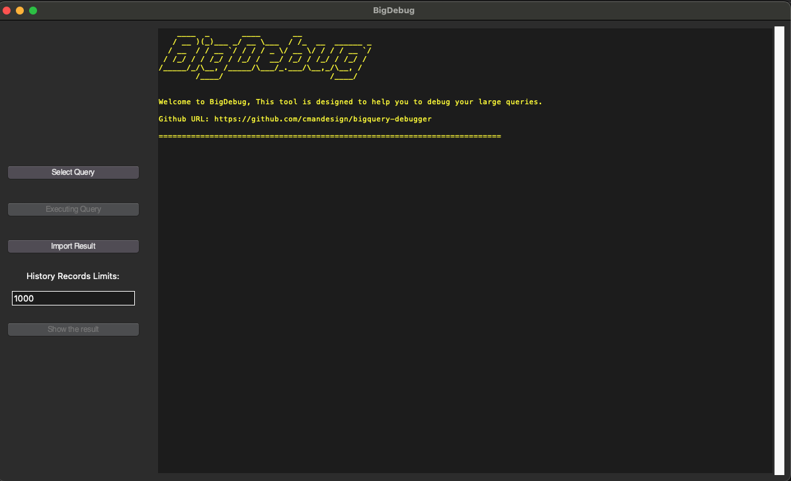

# BigDebug (BigQuery Debugger Tool)

<pre>
    ____  _       ____       __               
   / __ )(_)___ _/ __ \___  / /_  __  ______ _
  / __  / / __ `/ / / / _ \/ __ \/ / / / __ `/
 / /_/ / / /_/ / /_/ /  __/ /_/ / /_/ / /_/ / 
/_____/_/\__, /_____/\___/_.___/\__,_/\__, /  
        /____/                       /____/   
</pre>

## Description

BigDebug is an open-source tool designed to help people debug large BigQuery queries effectively. It provides a user-friendly GUI that allows users to inspect the results of subqueries and temporary tables step by step, making the debugging process more efficient and intuitive. Additionally, BigDebug supports saving query results, enabling users to import and inspect previous results without re-running expensive queries. The tool also generates a query tree to visualize the dependency and order of running queries, making it easier to understand complex query structures.

## Screenshots



## Features

- Step-by-step inspection of subqueries and temporary tables.
- User-friendly GUI for easy navigation.
- Support for analyzing complex nested queries.
- Detailed query execution information and statistics.
- Query optimization suggestions.
- Result saving and importing for offline inspection.
- Query tree visualization for query dependency and execution order.

## How to run ?

### Executable
Soon - WIP

### Run via Source

First you need Python 3.8 or higher . [Download Python](https://www.python.org/downloads/)
Then you can run following commands to run the project 

```
# Make sure your python is 3.8+
python3 --version

python3 -m venv venv 

pip install -r requirements.txt

```

Run the GUI

```
python gui.py
```

Run the CLI
```
python main.py input_sql_file.sql

# Or

python main.py input_sql_file.sql --limit 20000
```
## How to Contribute

We welcome contributions from the community! If you want to contribute to BigDebug, you can fork and create pull request to main branch.

## Issues

If you encounter any issues or have suggestions, please [create an issue](https://github.com/cmandesign/bigquery-debugger/issues) in this repository.

## License

This project is licensed under the MIT License